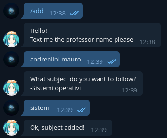

# POUB
Probably Overengineered Unimore Booker

A python-powered, actor-based, telegram-facing,
timetable-aware booker for unimore (if you know 
more adjectives to add please open an issue, I 
love this)

## How to run
Install the requirements.txt (preferrably using venv).
Change the `.env` file (or create an overriding
`.env.secret`) and specify your bot's token id and
your id in the whitelist. Then start the program!

`$ python3 poub/main.py`

All of the next configuration is done with the
configured bot.

At midnight the bot will fetch the lecture timings,
automatically select the correct room and book it
with your account (you first need to `/login` in the bot).

## Passwords
I really don't know of any way to book using unimore's
"trovaaula" without storing personal information so
this program stores **everything in cleartext** including
the username and password of each user.
**Don't use this if you do not trust the hoster**